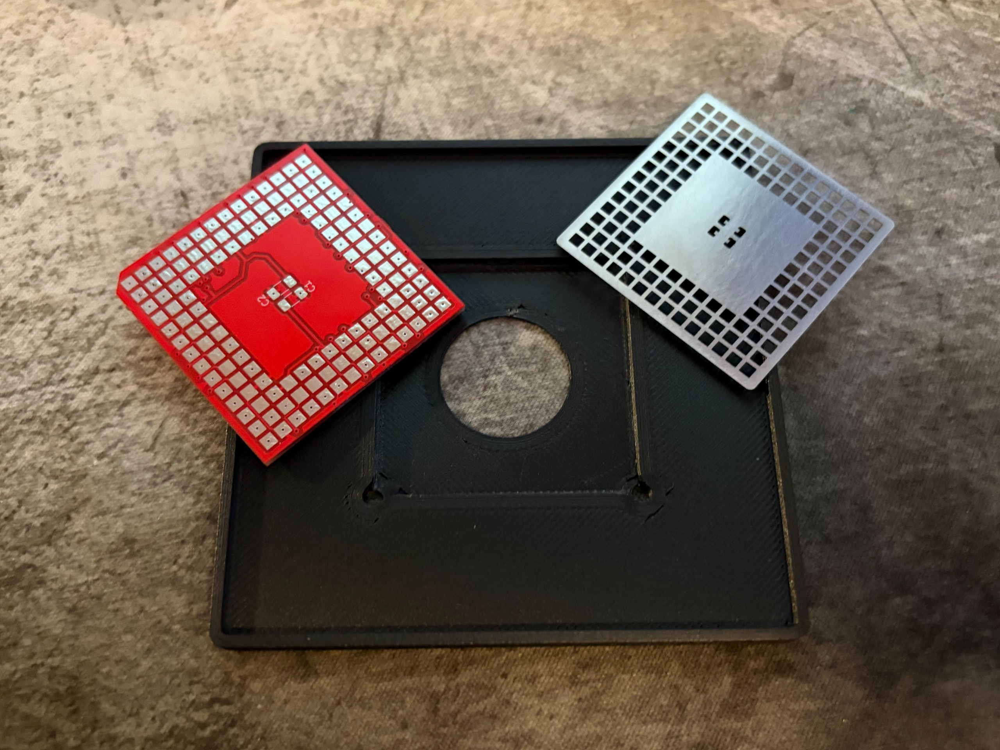
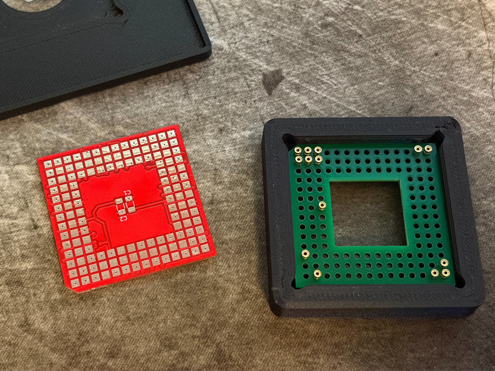
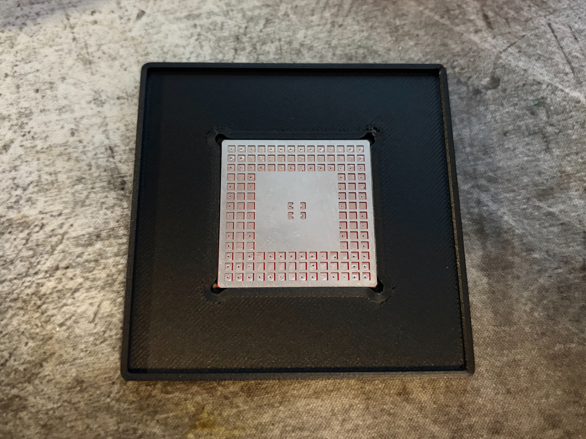
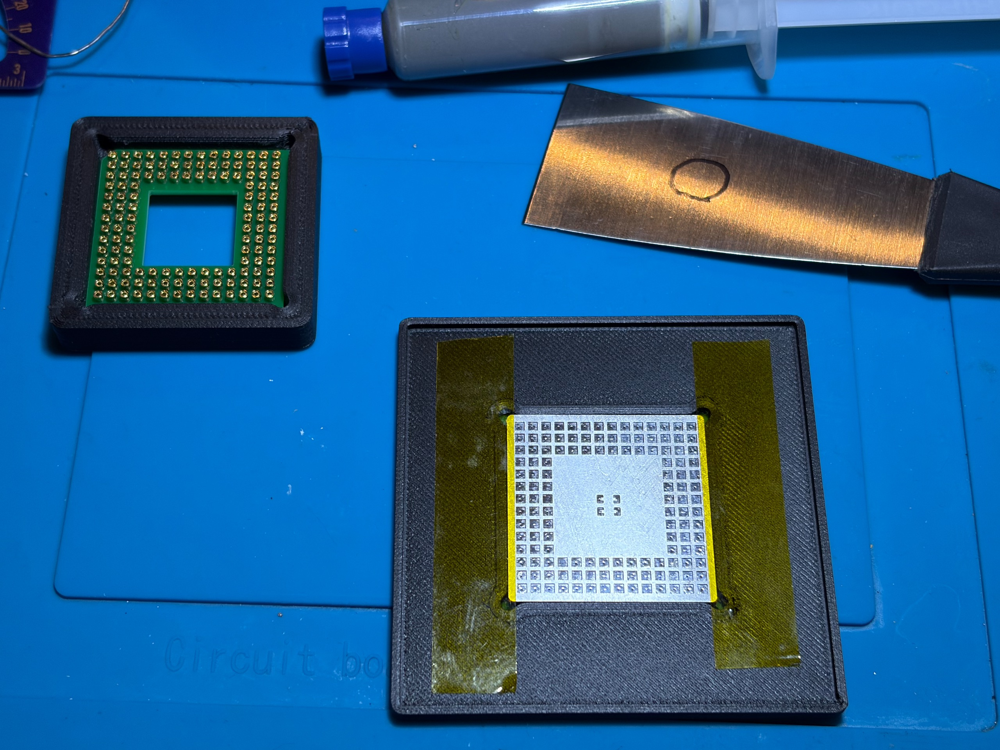
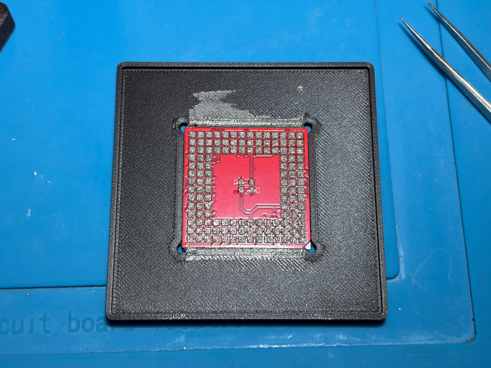
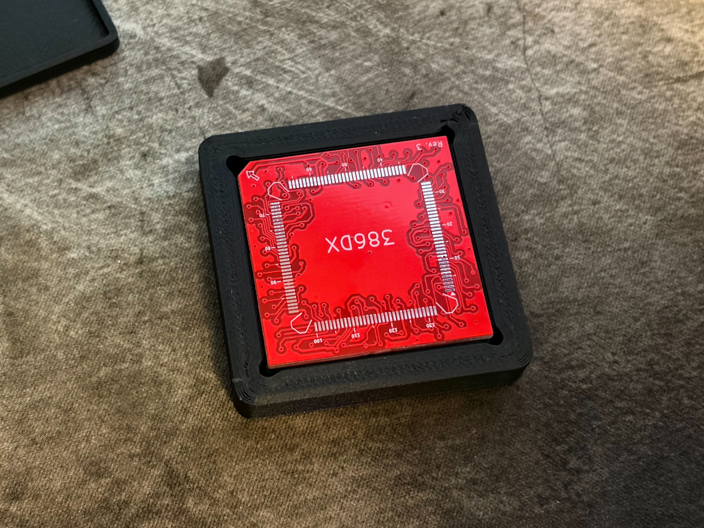
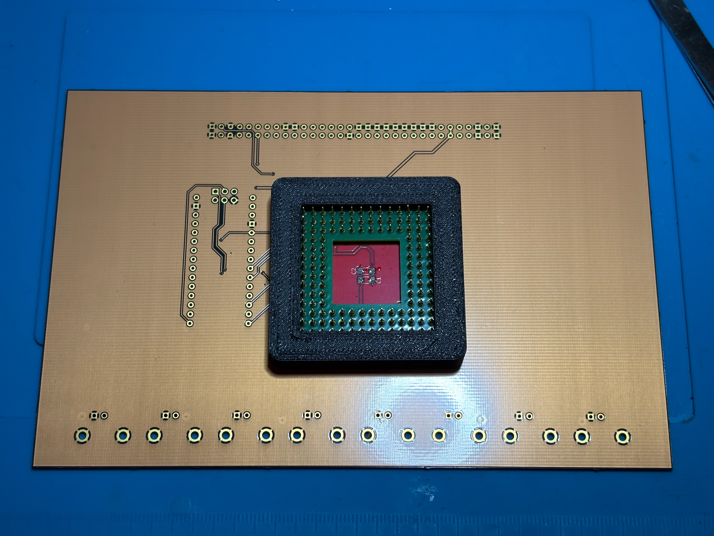
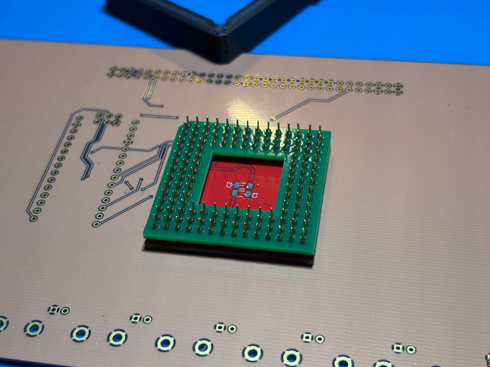
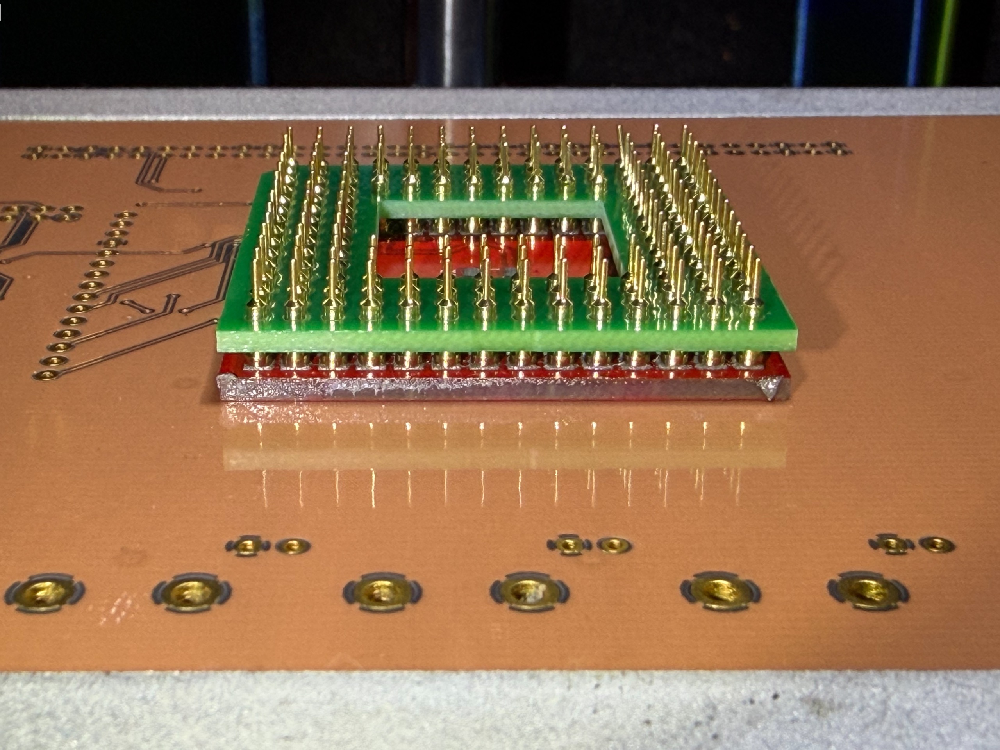
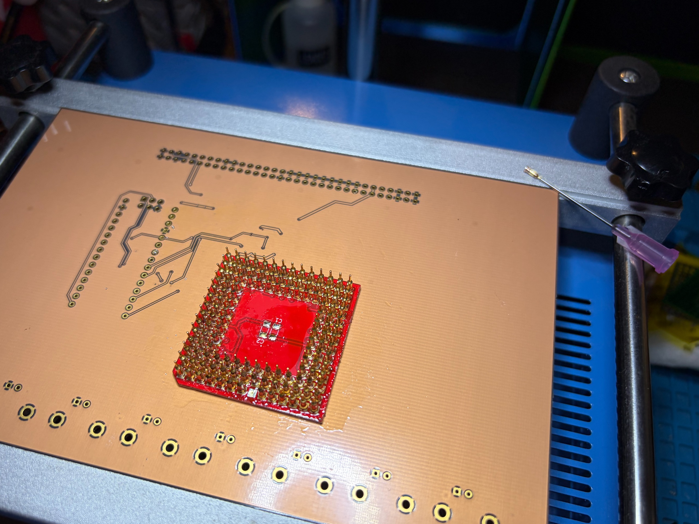

# 3D Printed Jigs

## Introduction

This project requires precsion during assembly. Therefore, I have designed a set of jigs to help.

*Note: I ordered the stencil in the dimension of 38x38mm, so it fits over the main PCB exactly.*

Pasting Jig:

Pin Assemnbly Jig:

## Printing

Both files can be easily printed as-is.

After printing, carefully inspect the inside cavities of both prints and clean up any debris that is stuck inside, which will prevent proper fitting and releasing of the PCBs.

## Preparation

To make sure the PCBs will release from the jigs smoothly, test fit them into the jigs.

If you notice the boards catching the jig, file down the edge where it is not flat.

## Usage

### Pasting Assembly

Fit the PCB inside the cavity of the print, with the PGA pads facing up. Then, close the stencil on the top.

To prevent the stencil from sliding when applying paste, put down some kepton tape on the sides of the stencil.

Carefully remove the tape first, then the stencil, with a pair of precision tweezers.

### Pin Assembly Jig

Using a pair of fine-tiped tweezers, insert all the pins one by one. They should go in without too much resistance when inserted vertically.

After all pins are in place, consider brushing the top surface of the pins with a small amount of flux to help with soldering.

### Soldering Preparations

With a pair of tweezers, loosen the main PCB from the pasting jig, from the hollowed corners of the Pasting Jig.

Carefully flip the pasted main PCB and fit it onto the top of the Pin Assembly Jig. Press down lightly so contact is made. Do NOT press down too hard as that might redistribute the paste and make soldering difficult.

Turn the entire assembly with the jig upside down and place on soldering surface (i.e. a heating plate)

Disembark the assembly from the jig by pressing down on the holder PCB with a tool (I used tweezers) while lifting up the Jig and away.

Finally, inspect that the pins are aligned properly with the pads.

*One of my pins is croocked in this photo. You need to look for similar issues.*

## Troubleshooting Tips

### Loose Pin After Soldering

If a pin came loose after you removed the holder PCB to inspect your work, you will find it difficult to put it back without a proper tool, as the pin will try to float and become croocked when heat is applied.

A hollow syringe needle with correct diameter will help hold the loose pin as you apply hot air to solder it back down.

